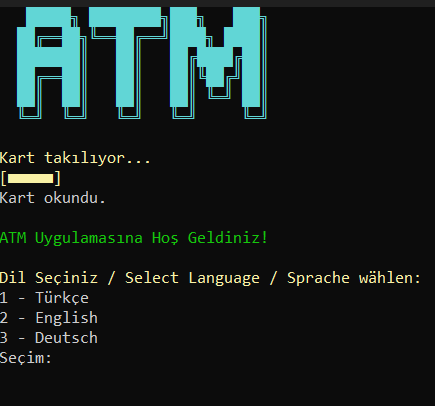
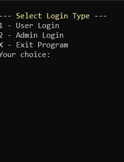
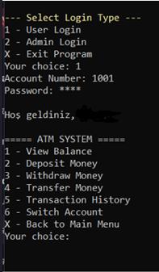

# ATM Simulation – C# Console Application

A fully featured ATM simulation built with C#.  
Includes:

- Multi-language support (TR / EN / DE)
- Theme customization
- Admin panel
- JSON-based data storage
- Account types
- Transaction logging
- User settings
- Clean and modular code structure

## 📁 Project Structure
- Banka.cs → Bank operations  
- Hesap.cs → Account model  
- Language.cs → Multi-language system  
- Theme.cs → Theme customization  
- UserSettings.cs → User preferences  
- Program.cs → Main application flow  

## ▶️ How to Run
1. Open the project in Visual Studio  
2. Build the solution  
3. Run the console application  

## 🎯 Purpose
This project was created to practice:
- OOP principles  
- File handling (JSON)  
- Modular C# architecture  
- Real-world application logic

🖼️ Screenshots

Start Screen  

Login Menu  

Main Menu  

